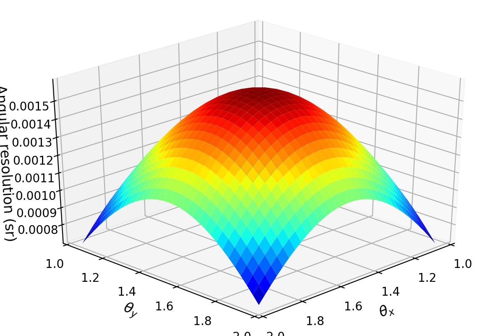
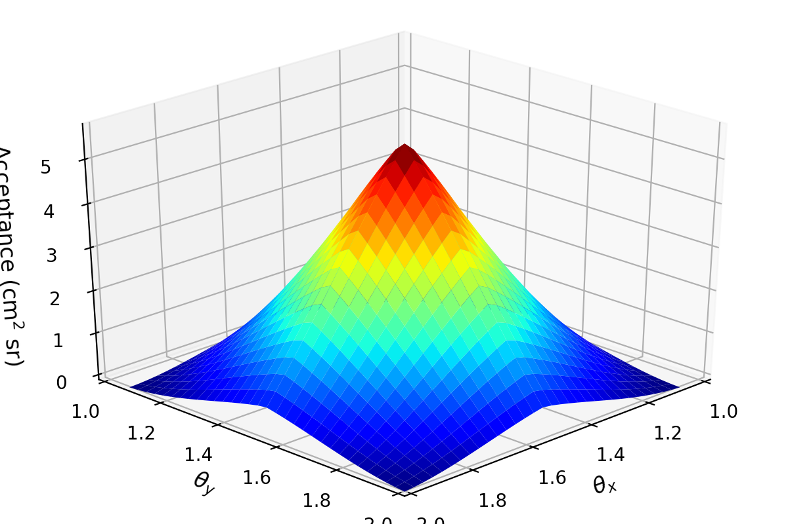

# Aceptance-for-muon-telescope
Obtaining the acceptance function numerically from the calculation of geometric acceptance based on the definition of the solid angle.

### Summary: 
With the following code we calculate the angular resolution and the acceptance for the MuTe-UIS Telescope.

Details for this calculation can be complemented and sustented from adjunt document in section 4.
{:height="40%" width="40%"}
{:height="40%" width="40%"}
